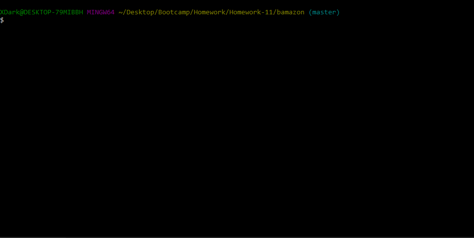

# bamazon
An app that uses MySQL and node to create a Amazon-like storefront

## Installation

1. Clone this repository to your computer and install dependencies:

with SSH:
```
git clone git@github.com:tintdang/bamazon.git
```

go to the root of your bamazon folder
```
npm install
```

2. Set up your MySQL credentials. Either open `bamazon.sql` in your sql editor, and run the script.


3. Run the app with one of the following commands. Usage for each is documented below:
```bash 
node bamazonCustomer.js
node bamazonManager.js
node bamazonSupervisor.js
```


# Features
## Customer
The `bamazonCustomer.js` is intended for your customers. Your customers will run `node bamazonCustomer.js`, the following will occur:
1. A table of your current iventory will be printed, displaying product names, IDs, departments, prices, and stock.
2. Customers will be prompted to enter the ID of the product they want to buy.
3. Customers will be asked how many units they want to buy.
4. Their total will be printed, and the inventory of the appropriate product will decrease. They may repeat this step until they complete their order. **NOTE**: if the customer wishes to buy more than what you have in stock, they will be alerted and taken back to the initial purchase prompt.

### Customer demo:
<p align='center'>

</p>

## Manager
The `bamazonManager.js` file provides an interface for store managers to view and modify inventory. The following commands are available:
1. `View Products For Sale`: This command will print a table of your current inventory, allowing easy access to important information on your products.
2. `View Low Inventory`: Print your current inventory that are low on stock that is lower than 5.
3. `Add To Inventory`: Allows you to update your database when receiving more product.
4. `Add New Product`: Allows you to add more products to your inventory.
5. `Quit`: Will let you exit the application

### Manager demo:
<p align='center'>

</p>

## Libraries used:
- [MySQL](https://github.com/mysqljs/mysql)
- [Inquirer](https://github.com/SBoudrias/Inquirer.js)
- [CLI-Table](https://github.com/Automattic/cli-table)
